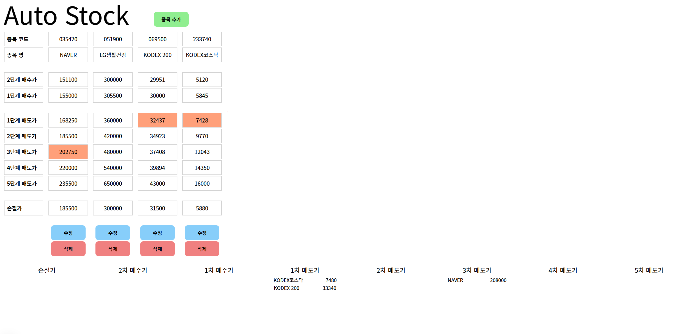

# Auto-Stock

아버지를 위한 국내 주식 포트폴리오 관리 보조 어플리케이션

## 기술 스택

#### Flask

    - Stock 관리
        - CRUD

    - 알리미
        - 크롤링 기반의 목표가(매수/매도) 도달 알리미

#### Next.js

    - Table 형식의 뷰를 제공
    - 꺾은선 그래프 제공 (종가 기준)

#### MySQL

    - 관심 종목의 데이터 저장

#### Docker-Compose

    - 네트워킹

## 포팅 메뉴얼

- `mkdir /autostock/mysql`
- `docker-compose up -d`

